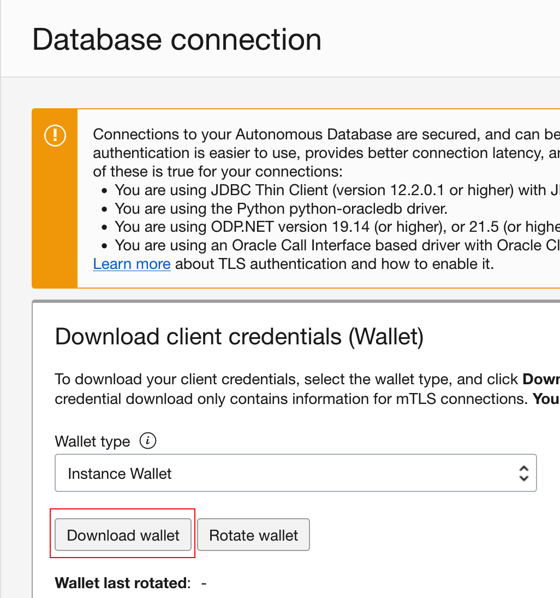

# Use the OCI vault to store the secret autonomous database username and password.

## Project description

The example code for Java spring boot using OCI vault to access the autonomous database.

## How to use code

### STEP 1

Clone the repo from GitHub by executing the command as follows:

```
[~] git clone https://github.com/Eric6986/oci-vault-adb-access.git
[~] cd oci-vault-adb-access/
[~/oci-vault-adb-access] ls -lt
-rw-r--r--  1 erichsieh  staff  10685 Feb  7 15:30 README.md
drwxr-xr-x  8 erichsieh  staff    256 Oct 10 11:30 target
-rwxr-xr-x  1 erichsieh  staff   3884 Sep 28 10:27 pom.xml
drwxr-xr-x  5 erichsieh  staff    160 Jul 12  2022 src
```

### STEP 2

Create your autonomous database in OCI console.
Login OCI -> Oracle Database -> Autonomous Database -> Create Autonomous Database
1. Give your database name
2. Pick the always free option if you have quota
3. Give your ADMIN password
4. Press the "Create Autonomous Database" button.


### STEP 3

Login to your adb and add new service user for application access.
Login OCI -> Oracle Database -> Autonomous Database -> Your database name -> Database actions -> Login as ADMIN -> Execute create user script
```
# Replace "<<service_adb_username>>" and "<<service_adb_password>>" as your value and execute in console. 
CREATE USER <<service_adb_username>> IDENTIFIED BY "<<service_adb_password>>";
GRANT CREATE SESSION TO <<service_adb_username>>;
GRANT CREATE TABLE TO <<service_adb_username>>;
GRANT UNLIMITED TABLESPACE TO <<service_adb_username>>;
```


### STEP 4

Add your password in OCI vault service and copy the secret OCID.
Login OCI -> Identity & Security -> Vault -> Create Vault -> Create Key -> Create username secret -> Create password secret


Copy the OCID from secret UI. Keep the two secret ID for Step 6.


### STEP 5

Download your autonomous database connection files from OCI console. 
Login OCI -> Oracle Database -> Autonomous Database -> Your database name -> Database connection -> Download wallet
Save the file in ~/Downloads/Wallet_<your_adb_name>.zip



```
[~/oci-vault-adb-access] unzip ~/Downloads/Wallet_<your_adb_name>.zip -d /tmp/Wallet_developmentdemo
Archive:  /Users/erichsieh/Downloads/Wallet_<your_adb_name>.zip
  inflating: /tmp/Wallet_developmentdemo/ewallet.pem
  inflating: /tmp/Wallet_developmentdemo/README
  inflating: /tmp/Wallet_developmentdemo/cwallet.sso
  inflating: /tmp/Wallet_developmentdemo/tnsnames.ora
  inflating: /tmp/Wallet_developmentdemo/truststore.jks
  inflating: /tmp/Wallet_developmentdemo/ojdbc.properties
  inflating: /tmp/Wallet_developmentdemo/sqlnet.ora
  inflating: /tmp/Wallet_developmentdemo/ewallet.p12
  inflating: /tmp/Wallet_developmentdemo/keystore.jks
[~/oci-vault-adb-access] cd /tmp/Wallet_developmentdemo
[/tmp/Wallet_developmentdemo] ls -lt
total 96
-rw-r--r--@ 1 erichsieh  wheel  3033 Feb  7 03:47 README
-rw-r--r--@ 1 erichsieh  wheel  6701 Feb  7 03:47 cwallet.sso
-rw-r--r--@ 1 erichsieh  wheel  6656 Feb  7 03:47 ewallet.p12
-rw-r--r--@ 1 erichsieh  wheel  7475 Feb  7 03:47 ewallet.pem
-rw-r--r--@ 1 erichsieh  wheel  3191 Feb  7 03:47 keystore.jks
-rw-r--r--@ 1 erichsieh  wheel   691 Feb  7 03:47 ojdbc.properties
-rw-r--r--@ 1 erichsieh  wheel   114 Feb  7 03:47 sqlnet.ora
-rw-r--r--@ 1 erichsieh  wheel   774 Feb  7 03:47 tnsnames.ora
-rw-r--r--@ 1 erichsieh  wheel  3378 Feb  7 03:47 truststore.jks
```

### STEP 6

Modify the configuration setting in spring.datasource.url for your ADB connection.
Modify the configuration setting in oci.tenant.region as your compartment setup region. Ex: ap-singapore-1
Modify the configuration setting in oci.tenant.adb-username-ocid for your ADB connection. 

```
[/tmp/Wallet_developmentdemo] cd ~/oci-vault-adb-access
[~/oci-vault-adb-access] vim src/main/resources/application.yml
...
    # Example: url: jdbc:oracle:thin:@<<adb_name>>_high?TNS_ADMIN=/tmp/Wallet_developmentdemo
    url: jdbc:oracle:thin:@developmentdemo_high?TNS_ADMIN=/tmp/Wallet_developmentdemo
...
...
    region: ap-singapore-1 
    adb-username-ocid: ocid1.vaultsecret.oc1.ap-singapore-1.ama.... # (Copy from step4)
    adb-password-ocid: ocid1.vaultsecret.oc1.ap-singapore-1.ama.... # (Copy from step4)
...
```

### STEP 6.1

If you deploy the application to OKE, you need to create a dynamic group to define what instance have the permission to call vault service.
And you need a policy to define what service will be invoked by this instance. For example, Vault service.


### STEP 7

Start your sprint boot project, then you will see the application to retrieve the secret from OCI Vault service.

```
[~/oci-vault-adb-access] mvn clean package -Dmaven.test.skip=true
...
[INFO] Replacing main artifact with repackaged archive
[INFO] ------------------------------------------------------------------------
[INFO] BUILD SUCCESS
[INFO] ------------------------------------------------------------------------
[INFO] Total time:  4.772 s
[INFO] Finished at: 2023-02-07T18:39:54+08:00
[INFO] ------------------------------------------------------------------------

[~/oci-vault-adb-access] java -jar target/device-api-0.0.1-SNAPSHOT.jar
...
[main] com.oracle.bmc.Region                    : Loaded service 'SECRETS' endpoint mappings: singapore-1.oci.oraclecloud.com}
[main] com.oracle.bmc.secrets.SecretsClient     : Setting endpoint to https://secrets.vaults.ap-singapore-1.oci.oraclecloud.com
[main] com.oracle.bmc.secrets.SecretsClient     : Setting endpoint to https://secrets.vaults.ap-singapore-1.oci.oraclecloud.com
[main] com.oracle.bmc.ClientRuntime             : Using SDK: Oracle-JavaSDK/2.11.0
[main] com.oracle.bmc.ClientRuntime             : User agent set to: Oracle-JavaSDK/2.11.0 (Mac OS X/13.1; Java/11.0.15; OpenJDK 
[main] com.oracle.bmc.http.ApacheConfigurator   : Setting connector provider to ApacheConnectorProvider
[main] com.oracle.bmc.secrets.SecretsClient     : Setting endpoint to https://secrets.vaults.ap-singapore-1.oci.oraclecloud.com
[main] com.oracle.bmc.secrets.SecretsClient     : Setting endpoint to https://secrets.vaults.ap-singapore-1.oci.oraclecloud.com
...
```
